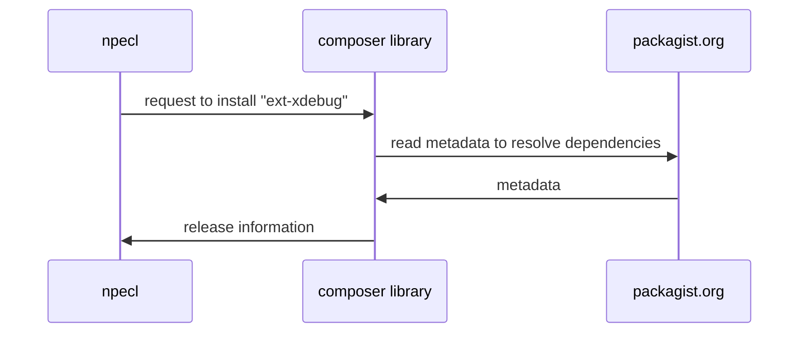
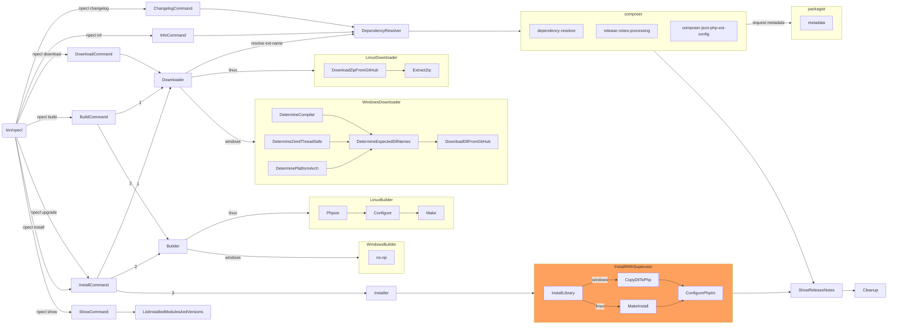

# npecl design

A work in progress design documentation for the "new pecl" iteration.

Basis:

 * [Discussion doc](https://docs.google.com/document/d/1_N0E9xo3jn9aKrIZHIbTYaY5lXw71BpSO6-it4cRpDo/edit)
 * Internal PHPF dev meet kick-off to review (minutes?)

## Name suggestions

 * npecl
 * Cucumber/Pickle adjacent:
   * 🥦 Floret / Broccoli
   * 🌱 Seedling / Sapling
   * 🍇 Grape / GraPHPe
   * 🥒 Enpickle / Pickled
 * Composer/Conductor/Orchestra adjacent:
   * 🎷 Sax / Saxophone
   * 🎺 Trumpet / Horn
   * 🎻 Violin

## Assumptions

 * `npecl` is the assumed name in this document, although this is to be discussed and confirmed.
 * `npecl` is a CLI tool, probably bundled as a PHAR like Composer is
   * therefore a usage such as `npecl install <thing>` assumes the PHAR exist in `$PATH`, for example in
     `/usr/bin/npecl`. If not, you would do something like `php npecl.phar install <thing>`.
 * Following investigation into Pickle, we have determined that the new PECL tool will be a new PHP Foundation based
   project. However, we are planning to copy some parts from Pickle, given the great work already done on that project.
   Following the terms of the [New BSD licence](https://github.com/FriendsOfPHP/pickle/blob/master/LICENSE), the parts
   copied from Pickle will have an additional copyright and licence, and credit to the original Pickle contributors.

## Out of initial scope

Whilst we are not going to rule out EVER implementing the following features, we just don't plan to include them in the
initial version of this new tool. We will consider these items for future inclusion and improvements:

 * `npecl self-update` - we can likely replicate the way Composer does a self-update, but this is out of initial scope
   since we will be distributing as a PHAR, it is relatively straightforward to do a simple replacement to begin with.
 * Compiling Windows binaries on the fly on the end-users system. We will rely on precompiled Windows binaries in the
   GitHub release assets to begin with.
 * Binary distribution for any other platform except Windows. We will rely on compiling binaries on the fly on the end-
   user's system for all platforms except Windows to begin with.
 * Installing extensions per-project
 * Ability to process a per-project `composer.json` and install missing extensions globally
 * Dealing with signing infrastructure and verification of signatures
 * Changelog section in composer.json
 * Adding "search" to the npecl tool
 * List security issues in `composer.json` file

## npecl itself

 * use `symfony/console` to simplify writing the CLI tool itself
 * use `composer/composer` to resolve dependencies; it knows how to do all this stuff already, lets not re-invent the
   wheel - once we have a better idea of what calls we need to make, it may make sense to split some of
   `composer/composer` out into separate libraries we can consume; although that might be a huge undertaking in itself,
   so is really just a "strech goal".
 * There may be multiple versions of php on a system. The version of php invoking `npecl` would be assumed, and its
   corresponding `phpize` tool would be used.
 * `npecl` would probably need to be run with `sudo` access (so it can `make install` to root-owned paths). Care should
   be taken to ensure only the minimal amount is run with elevated privileges, so we don't accidentally give root to a
   malicious PECL package. Ideally, `npecl` would run without `sudo`, and just prompt for access, if possible.

### CLI commands

#### `install {ext-name}{?:version-constraint}{?@dev-branch-name}`

Installs the requested package. The package may be requested with or without `ext-` prefix. `npecl install ext-xdebug`
and `npecl install xdebug` would be equivalent.

If `version-constraint` is given, try to install that version if it matches the allowed versions.

On Windows this downloads the correct DLL (attached as file to the release tag), if available. Otherwise, it will
download the source and compile the extension.

It will then attempt to create a 20-{extension_name}.ini file with `extension={extension_name}` in the directory
returned by `php-config –ini-dir`, the name that is used is the one from the "name" element in the metadata file.

If `@dev-branch-name` is given, try to install from the branch called "branch-name", for example use `@dev-master` to
compile from your master branch. As branches would usually not have binaries, this would not work for Windows.

You can't use both a `version-constraint` and `@dev-branch-name` at the same time.

Each step should run with as few privileges as possible.

#### `build {ext-name}{?:version-constraint}{?@dev-branch-name}`

Same behaviour as install, but only compiles (or downloads if it's Windows).

#### `changelog {?version}`

Shows the release notes of the version it was going to install, or from the specific version, if given.

#### `download {ext-name}{?:version-constraint}{?@dev-branch-name}`

Same behaviour as build, but puts the files in a local directory for manual building and installation.

#### `info`

Shows the description from the metadata file

#### `list`

Shows all available commands

#### `show`

Shows all installed extensions available with the PHP version in the path, including their versions. This includes
*all* loaded PHP extensions, and not just npecl ones.

#### `verify {?version-constraint}`

Shows the signature of the person who signed the version npecl would install, or from the specific version, if given.

#### `upgrade {?{ext-name}{?:version-constraint}{?@dev-branch-name}}`

Attempts to upgrade all installed versions to the latest available ones on GitHub (unless their major version has
changed) If a specific package is specified, only attempt to upgrade that specific one.

### CLI Options

#### `--dry-run`

Shows what it is about to do, but doesn't actually install

#### `--force`

To attempt to install a version that doesn't match the version constraints from the meta-data, for instance to install
an older version than recommended, or when the signature is not available.

#### `--with-php-config=/path/to/php-config`

Allows installation of extensions with PHP versions that are not in the path

#### `--{option}{?=value}`

All options specified in the `config` section of the composer.json file can also be given, including a value if they
take them. For example, for Xdebug you could run `npecl install xdebug --without-xdebug-compression`.

## Extension maintainer: register an npecl package

Create a `composer.json` in your repository, commit:

```json
{
    "name": "ext-xdebug",
    "type": "php-ext-zend",
    "license": "Xdebug-1.03",
    "description": "Xdebug is an amazing tool...",
    "require": {
        "ext-zlib": "*",
        "php": ">=7.4.21,<8.4"
    },
    "conflict": {
        "ext-zetalib": "*"
    },
    "php-ext": {
        "priority": 80,
        "configure-options": [
            {
                "name": "enable-xdebug-dev",
                "description": "Enable developer flags"
            },
            {
                "name": "without-xdebug-compression",
                "description": "Disable compression through zlib"
            },
            {
                "name": "some-path-to-something",
                "description": "This should be the path to the thing that is needed."
            }
        ]
    }
}
```

Submit your repo URL into [https://packagist.org/packages/submit](https://packagist.org/packages/submit). Packagist
will read the `composer.json` as usual.

When releases are made, Packagist will do the usual thing of producing metadata for the release

### Windows binaries

Windows needs pre-built binary DLLs. The expected workflow is that the release is made, then some kind of build takes
place (for example, in a GitHub Action, or manually on a compatible build environment), and the `.dll` file is added to
the GitHub release.

The name for the DLLs must follow the following pattern:

 * `php_{extension-name}-{tag}-{php-maj/min}-{compiler}{"-nts"}?{-arch}.dll`

The descriptions of these items:

 * `extension-name` the name of the extension, e.g. `xdebug` - this is the same as defined in `composer.json` minus `ext-`
 * `tag` for example `3.3.0alpha3` - defined by the tag/release you have made
 * `php-maj/min` - for example `8.3` for PHP 8.3.*
 * `compiler` - usually something like `vc16` - this should match the `PHP_COMPILER_ID`
 * `-nts` - optional - non-thread safe. If omitted, thread-safe mode (ZTS) is assumed.
 * `-arch` - for example `AMD64`, fetch using `php -r "echo php_uname('m');"`.

### Notes on the `composer.json`

 * The `name` is not a typical `vendor/package` format, it is `ext-package` format.
 * The `type` dictates if it is a PHP Module (`php-ext`) or a Zend Extension (`php-ext-zend`).
 * Typically, there will be almost no `require` definitions, except `php` version itself
 * The `php-ext` is a new top-level element to provide additional metadata for building the extension, if required.
   * Proposed JSON schema for this is in [composer-json-php-ext-schema.json](./composer-json-php-ext-schema.json)

## End user: installing an npecl package

Run:

```bash
$ npecl install ext-xdebug
```

npecl uses `composer/composer` library to help resolve dependencies



 * if a downstream dep (e.g. `ext-zlib` in the `ext-xdebug` example above) is not installed, Composer can detect this
   missing depenedency, and warn accordingly.

Once we have the release information, for Linux:

### non-Windows installation

 * download/extract the source tarball
 * run `phpize`
 * run `./configure <options>`
 * run `make`
 * run `make install` (note: this part may need `sudo`)

The `<options>` for `./configure` come from the `$.php-ext.configure-options` section in `composer.json`. These would
be specified as part of the `build` or `install` commands. Here are some examples:

```bash
$ npecl install xdebug
$ npecl install xdebug --enable-xdebug-dev
$ npecl install xdebug --enable-xdebug-dev --without-xdebug-compression
$ npecl install xdebug --some-path-to-something=/usr/local/lib/something
$ npecl install xdebug --not-a-defined-configuration-option # this would fail
```

### Windows installation

Determine the expected name for the Windows DLL:

 * `extension-name` - We know this already minus `ext-` from the package name
 * `tag` - Composer gave us the release version
 * `php-maj/min` - We know this from the version of PHP that invoked `npecl`
 * `compiler` - processed from `PHP_COMPILER_ID` (if possible in userland) or [parsing phpinfo, like xdebug](https://github.com/xdebug/xdebug.org/blob/9e0df8c80a6942e506a5fae91307da5bbcc08787/src/XdebugVersion.php#L276-L299).
 * `-nts` or omitted - We know this from the version of PHP that invoked `npecl`
* `-arch` - for example `AMD64`, fetch using `php -r "echo php_uname('m');"`.

Because arch is optional, we have to try therefore, the following file formats, in order:

 * `php_{extension-name}-{tag}-{php-maj/min}-{compiler}{-nts}-{platform}.dll`
   * example for a non-TS request for xdebug `3.3.0alpha3` on PHP 8.3 on an `AMD64` machine: `php_xdebug-3.3.0alpha3-8.3-vs16-nts-AMD64.dll`

If the release is found:

 * download the dll from the release assets. Perhaps only support GitHub API initially - Composer does not support
   fetching/listing assets, so we would need to build this.
 * put the DLL into the appropriate place for the PHP install

### Remaining steps:

 * Configure ini
   * If `php-config --ini-dir` exists, and there is no `{priority}-{extension-name}.ini` (or `{extension-name}.ini`?)
     file, create one with contents:
     ```ini
     extension/zend_extension"={extension-name}
     ```
     in the "conf.d" directory (if configured).
   * If the file `{priority}-{extension-name}.ini` or `{extension-name}.ini` exists in the downloaded release tarball,
     append its contents to the created file. If the INI path does not exist, create a "temp" ini file that developers
     can copy into a directory, or append to their php.ini file(s).
 * Show the release notes
   * Composer itself MAY be working on such a thing, so lets co-ordinate with Composer team before re-inventing the
     wheel.
   * There are several source we could get release notes from:
     * GitHub Release (use API to fetch)
     * The git tag (use `git` to read)
     * A file called `CHANGELOG` / `CHANGELOG.md` / `CHANGES` etc. (or other variations)
 * Clean up downloaded and build files

## High level overview

This graph is a high level overview of the key processes of downloading, building and installing both Windows and Linux
based PHP extensions:


