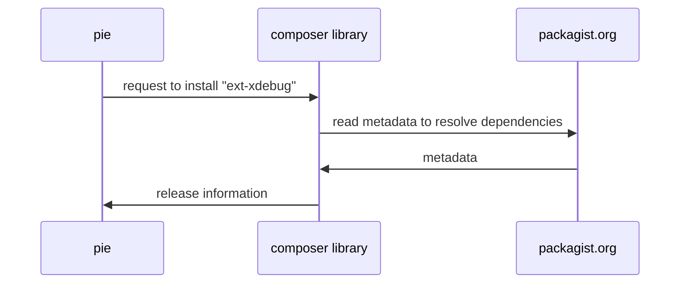

# 🥧 PIE (PHP Installer for Extensions) Design

A work in progress design documentation for the "new pecl" iteration.

Basis:

* [Discussion doc](https://docs.google.com/document/d/1_N0E9xo3jn9aKrIZHIbTYaY5lXw71BpSO6-it4cRpDo/edit)
* Internal PHPF dev meet kick-off to
  review ([minutes](https://gist.github.com/pronskiy/621bc8f8e901d4cd1f5a630c463be5b2))

## Naming

The current favourite name is `pie`, the **P**HP **I**nstaller for **E**
xtensions.

* npecl
* Cucumber/Pickle adjacent:
    * 🥦 Floret / Broccoli
    * 🌱 Seedling / Sapling
    * 🍇 Grape / GraPHPe
    * 🥒 Enpickle / Pickled
* Composer/Conductor/Orchestra adjacent:
    * 🎷 Sax / Saxophone
    * 🎺 Trumpet / Horn
    * 🎻 Violin
* Community suggestions:
    * 🌶️
      Pepper ([src](https://twitter.com/simonhamp/status/1758446710295036412))
    * php-ext ([src](https://twitter.com/carlos_granados/status/1758445815209599182))
    * phpem/pem / PHP Extension
      Manager ([src](https://twitter.com/strandafili/status/1758447294234386765))
    * install-php-extension ([src](https://phpc.social/@ocramius@mastodon.social/111940752578558129)
    * 🥧 **PIE / PHP Installer for Extensions** ([src](https://phpc.social/@psycodepath@mastodon.social/111940835012754835))
    * Composter ([src](https://twitter.com/rdohms/status/1758450203185512581))
    * Compecler ([src](https://phpc.social/@rskuipers/111940888231727790))
    * Maestro ([src](https://twitter.com/imightbedavi/status/1758452730350141748))
    * phex ([src](https://twitter.com/GaelReyrol/status/1758452113661653356))

## Assumptions

* `pie` is the assumed name in this document, although this is to be discussed
  and confirmed.
* `pie` is a CLI tool, probably bundled as a PHAR like Composer is
    * therefore a usage such as `pie install <thing>` assumes the PHAR exist
      in `$PATH`, for example in
      `/usr/bin/pie`. If not, you would do something
      like `php pie.phar install <thing>`.
* Following investigation into Pickle, we have determined that the new PECL tool
  will be a new PHP Foundation based
  project. However, we are planning to copy some parts from Pickle, given the
  great work already done on that project.
  Following the terms of
  the [New BSD licence](https://github.com/FriendsOfPHP/pickle/blob/master/LICENSE),
  the parts
  copied from Pickle will have an additional copyright and licence, and credit
  to the original Pickle contributors.

## Out of initial scope

Whilst we are not going to rule out EVER implementing the following features, we
just don't plan to include them in the
initial version of this new tool. We will consider these items for future
inclusion and improvements:

* `pie self-update` - we can likely replicate the way Composer does a
  self-update, but this is out of initial scope
  since we will be distributing as a PHAR, it is relatively straightforward to
  do a simple replacement to begin with.
* Compiling Windows binaries on the fly on the end-users system. We will rely on
  precompiled Windows binaries in the
  GitHub release assets to begin with.
* Binary distribution for any other platform except Windows. We will rely on
  compiling binaries on the fly on the end-
  user's system for all platforms except Windows to begin with.
* Installing extensions per-project
* Ability to process a per-project `composer.json` and install missing
  extensions globally
* Dealing with signing infrastructure and verification of signatures
* Changelog section in composer.json
* Adding "search" to the PIE tool
* List security issues in `composer.json` file

## PIE itself

* use `symfony/console` to simplify writing the CLI tool itself
* use `composer/composer` to resolve dependencies; it knows how to do all this
  stuff already, lets not re-invent the
  wheel - once we have a better idea of what calls we need to make, it may make
  sense to split some of
  `composer/composer` out into separate libraries we can consume; although that
  might be a huge undertaking in itself,
  so is really just a "strech goal".
* There may be multiple versions of php on a system. The version of php
  invoking `pie` would be assumed, and its
  corresponding `phpize` tool would be used. To use a different installed PHP
  version, you could use (for example)
  `/usr/bin/php8.2 /usr/bin/pie ...`
* Parts of `pie` will need to be run with `sudo` access (so it
  can `make install` to root-owned paths). Care should
  be taken to ensure only the minimal amount is run with elevated privileges, so
  we don't accidentally give root to a
  malicious PECL package. Ideally, `pie` would run without `sudo`, and just
  prompt for access, when needed (for
  example, by invoking a sub-process with `sudo`.

### CLI commands

#### `install {ext-name}{?:version-constraint}{?@stability}`

Installs the requested package. The package may be requested with or
without `ext-` prefix. `pie install ext-xdebug`
and `pie install xdebug` would be equivalent.

If `version-constraint` is given, try to install that version if it matches the
allowed versions. Version constraints are resolved using the same format as
Composer, along with the minimum stability.

 * `^1.0` will install the latest stable and backwards-compatible version with
   `1.0.0` and above, according to semantic versioning. [See Composer docs for details](https://getcomposer.org/doc/articles/versions.md#caret-version-range-).
 * `^2.3@beta` will install the latest beta and backwards-compatible version
   with `2.3.0` and above (for example, `2.3.0-beta.3`).
 * `dev-main` will install the latest commit on the `main` branch at the time
   of command execution. This would not work with Windows, as there is no
   release with Windows binaries.
 * `dev-main#07f454ad797c30651be8356466685b15331f72ff` will install the specific
   commit denoted by the commit sha after `#`, in this case the commit
   `07f454ad797c30651be8356466685b15331f72ff` would be installed. This would
   not work with Windows, as there is no release with Windows binaries.

If no `version-constraint` is given, try to install any compatible latest and
stable version.

On Windows this downloads the correct DLL (attached as file to the release tag),
if available. Otherwise, it will
download the source and compile the extension.

It will then attempt to create a `20-{extension_name}.ini` file
with `extension={extension_name}` in the directory
returned by `php-config --ini-dir`, the name that is used is the one from the
"name" element in the metadata file.

If the extension is a Zend extension (such as Xdebug), then it will write the
line `zend_extension={extension_name}`
instead.

If the extension has a composer.json defined priority, the `20` in the ini file
filename will be replaced by that
priority.

Each step should run with as few privileges as possible.

#### `build {ext-name}{?:version-constraint}{?@stability}`

Same behaviour as install, but only compiles (or downloads if it's Windows).

#### `changelog {?version}`

Shows the release notes of the version it was going to install, or from the
specific version, if given.

#### `download {ext-name}{?:version-constraint}{?@stability}`

Same behaviour as build, but puts the files in a local directory for manual
building and installation.

#### `info`

Shows the description from the metadata file

#### `list`

Shows all available commands

#### `show`

Shows all installed extensions available with the PHP version in the path,
including their versions. This includes
*all* loaded PHP extensions, and not just PIE-sourced ones.

#### `upgrade {?{ext-name}{?:version-constraint}{?@stability}}`

Attempts to upgrade all installed versions to the latest available ones on
GitHub (unless their major version has
changed). If a specific package is specified, only attempt to upgrade that
specific one.

### CLI Options

#### `--dry-run`

Shows what it is about to do, but doesn't actually install

#### `--force`

To attempt to install a version that doesn't match the version constraints from
the meta-data, for instance to install
an older version than recommended, or when the signature is not available.

#### `--with-php-config=/path/to/php-config`

Allows installation of extensions with PHP versions that are not in the path

#### `--{option}{?=value}`

All options specified in the `configure-options` section of the composer.json
file can be given, including a value if they take them. For example, for Xdebug
you could run `pie install xdebug --without-xdebug-compression`.

## Extension maintainer: register a PIE package

Create a `composer.json` in your repository, and commit it. The following is
ONLY AN EXAMPLE, and is not necessarily the real `composer.json` in Xdebug.

```json
{
    "name": "xdebug/xdebug",
    "type": "php-ext-zend",
    "license": "Xdebug-1.03",
    "description": "Xdebug is an amazing tool...",
    "require": {
        "ext-something": "*",
        "php": ">=7.4.21,<8.4"
    },
    "conflict": {
        "ext-a-conflicting-extension": "*"
    },
    "replace": {
        "ext-xdebug": "*"
    },
    "php-ext": {
        "name": "ext-xdebug",
        "priority": 80,
        "support-zts": false,
        "configure-options": [
            {
                "name": "enable-xdebug-dev",
                "description": "Enable developer flags"
            },
            {
                "name": "without-xdebug-compression",
                "description": "Disable compression through zlib"
            },
            {
                "name": "some-path-to-something",
                "needs-value": true,
                "description": "This should be the path to the thing that is needed."
            }
        ]
    }
}
```

Submit your repo URL
into [https://packagist.org/packages/submit](https://packagist.org/packages/submit).
Packagist
will read the `composer.json` as usual.

When releases are made, Packagist will do the usual thing of producing metadata
for the release

### Notes on the `composer.json`

* The `name` MUST be in a typical `vendor/package` format seen in regular
  Composer PHP packages, for example `asgrim/my-ext`.
* The `type` dictates if it is a PHP Module (`php-ext`) or a Zend
  Extension (`php-ext-zend`).
* Typically, there will be almost no `require` definitions, except `php` version
  itself.
* The `php-ext` is a new top-level element to provide additional metadata for
  building the extension, if required.
    * Whilst it is not mandatory, a PIE package SHOULD specify the extension
      name in the `extension-name` field. If the `extension-name` is omitted,
      invalid, or an empty string, the `extension-name` will be derived from
      the top level `name`. The `vendor/` prefix will be removed, and that will
      be used as the extension name, for example `asgrim/my-ext` will become
      `ext-my-ext`. The `extension-name` field, if defined, may or may not have
      the `ext-` prefix, and tooling such as PIE will be expected to normalise
      this appropriately.
    * Proposed JSON schema for this is
      in [composer-json-php-ext-schema.json](./composer-json-php-ext-schema.json)
    * It is assumed that packages all support Zend Thread Safe mode (ZTS). If a
      package does **not** support ZTS mode,
      the key `"support-zts": false` should be set in `php-ext` section, but you
      may explicitly advertise ZTS support by
      specifying `"support-zts": true`.
* There is a slight disconnect between the Composer package name, and the
  extension name itself, although typically extension authors are expected to
  provide some predictable consistency between them (for example, a package
  named `xdebug/xdebug` would reasonably be expected to name the extension as
  `ext-xdebug`). To help semantic understanding, a PIE package MAY optionally
  specify a `replace` for the extension, in the format `ext-my-ext`. Whilst this
  will not be used by PIE (at least for now), it may provide some benefit in
  understanding the correlation between the package name (e.g. `asgrim/my-ext`)
  and the extension name (e.g. `ext-my-ext`).

### Windows binaries

Windows needs pre-built binary DLLs. The expected workflow is that the release
is made, then some kind of build takes
place (for example, in a GitHub Action, or manually on a compatible build
environment), and the `.zip` file is added to
the GitHub release.

The name for the ZIP must follow the following pattern:

* `php_{extension-name}-{tag}-{php-maj/min}-{ts|nts}-{compiler}-{arch}.zip`
* Example: `php_xdebug-3.3.2-8.3-ts-vs16-x86_64.zip`

The descriptions of these items:

* `extension-name` the name of the extension, e.g. `xdebug`
* `tag` for example `3.3.0alpha3` - defined by the tag/release you have made
* `php-maj/min` - for example `8.3` for PHP 8.3.*
* `compiler` - usually something like `vc6`, `vs16` - fetch from
  'PHP Extension Build' flags in `php -i`
* `ts|nts` - Thread-safe or non-thread safe.
* `arch` - for example `x86_64`.
  * Windows: `Architecture` from `php -i`
  * non-Windows: check `PHP_INT_SIZE` - 4 for 32-bit, 8 for 64-bit.

#### Contents of the Windows ZIP

The pre-built ZIP should contain at minimum a DLL named in the same way as the
ZIP itself, for example
`php_{extension-name}-{tag}-{php-maj/min}-{ts|nts}-{compiler}-{arch}.dll`.
The `.dll` will be moved into the PHP
extensions path, and renamed, e.g.
to `C:\path\to\php\ext\php_{extension-name}.dll`. The ZIP file may include
additional resources, such as:

* `php_{extension-name}.pdb` - this will be moved alongside
  the `C:\path\to\php\ext\php_{extension-name}.dll`
* `*.dll` - any other `.dll` would be moved alongside `C:\path\to\php\php.exe`
* Any other file, which would be moved
  into `C:\path\to\php\extras\{extension-name}\.`

## End user: installing a PIE package

Run:

```bash
$ pie install ext-xdebug
```

PIE uses `composer/composer` library to help resolve dependencies



* if a downstream dep (e.g. `ext-something` in the `ext-xdebug` example above)
  is not installed, Composer can detect
  this missing depenedency, and warn accordingly.
* whilst it would be useful for end users, library requirements will not
  currently be factored into the `composer.json`
  dependencies, due to the complexity of different package managers on different
  platforms.
* The package will be checked to see if it is compatible with ZTS mode. If using
  a `--with-php-config` with ZTS
  enabled, but the extension specifies `"support-zts": false` in
  its `composer.json` manifest, the installation will
  be halted with an error explanation.

Once we have the release information, for Linux:

### non-Windows installation

* download/extract the source tarball
* run `phpize`
* run `./configure <options>`
* run `make`
* run `make install` (note: this part may need `sudo`)

The `<options>` for `./configure` come from the `$.php-ext.configure-options`
section in `composer.json`. These would
be specified as part of the `build` or `install` commands. Here are some
examples:

```bash
$ pie install xdebug
$ pie install xdebug --enable-xdebug-dev
$ pie install xdebug --enable-xdebug-dev --without-xdebug-compression
$ pie install xdebug --some-path-to-something=/usr/local/lib/something
$ pie install xdebug --not-a-defined-configuration-option # this would fail
```

### Windows installation

When installing the extension on Windows, the PHP version invoking PIE would be
used for determining the PHP version,
library install path and so on, unless `--with-php-path=<php-path>` is provided.
Example:

```powershell
# Assuming C:\usr\php8.3.4\php.exe is in the $PATH
$ pie install xdebug                                     # uses C:\usr\php8.3.4\php.exe (i.e. the version that invoked PIE)
$ pie install xdebug --with-php-path="C:\usr\php7.4.33"  # uses C:\usr\php7.4.33\php.exe
```

In the follow examples, the `$PHP_PATH` is whichever the path is given above,
e.g. `C:\usr\php8.3.4`
or `C:\usr\php7.4.33`

Determine the expected name for the Windows ZIP:

* `extension-name` - We know this already minus `ext-` from the package name
* `tag` - Composer gave us the release version
* `php-maj/min` - We know this from the version of PHP that invoked `pie`
* `compiler` - processed from `PHP_COMPILER_ID` (if possible in userland)
  or [parsing phpinfo, like xdebug](https://github.com/xdebug/xdebug.org/blob/9e0df8c80a6942e506a5fae91307da5bbcc08787/src/XdebugVersion.php#L276-L299).
* `-nts` or omitted - We know this from the version of PHP that invoked `pie`
* `-arch` - for example `x86_64`, fetch using `php -r "echo php_uname('m');"`.

Because arch is optional, we have to try therefore, the following file formats,
in order:

* `php_{extension-name}-{tag}-{php-maj/min}-{ts|nts}-{compiler}-{arch}.zip`
    * example for a non-TS request for xdebug `3.3.0alpha3` on PHP 8.3 on
      an `x86_64`
      machine: `php_xdebug-3.3.0alpha3-8.3-nts-vs16-x86_64.zip`

If the release is found:

* download the ZIP from the release assets. Perhaps only support GitHub API
  initially - Composer does not support
  fetching/listing assets, so we would need to build this.
* Extract the ZIP to a temporary location
* Move the contents of the ZIP according to these rules:
    * Move `php_{extension-name}-{tag}-{php-maj/min}-{ts|nts}-{compiler}-{arch}.dll`
      to `$PHP_PATH\ext\php_{extension-name}.dll`
    * Move `php_{extension-name}.pdb`
      to `$PHP_PATH\ext\php_{extension-name}.pdb` (if it exists)
    * Move `*.dll` to `$PHP_PATH\*.dll` (if they exist, but
      exclude `php_{extension-name}.dll`)
    * Move any other file in the ZIP to `$PHP_PATH\extras\{extension-name}\.`

### Remaining steps:

* Configure ini
    * If `php-config --ini-dir` exists, and there is
      no `{priority}-{extension-name}.ini` (or `{extension-name}.ini`?)
      file, create one with contents:
      ```ini
      extension/zend_extension={extension-name}
      ```
      in the "conf.d" directory (if configured).
    * If the file `{priority}-{extension-name}.ini` or `{extension-name}.ini`
      exists in the downloaded release tarball,
      append its contents to the created file. If the INI path does not exist,
      create a "temp" ini file that developers
      can copy into a directory, or append to their php.ini file(s).
* Show the release notes
    * Composer itself MAY be working on such a thing, so lets co-ordinate with
      Composer team before re-inventing the
      wheel.
    * There are several source we could get release notes from:
        * GitHub Release (use API to fetch)
        * The git tag (use `git` to read)
        * A file called `CHANGELOG` / `CHANGELOG.md` / `CHANGES` etc. (or other
          variations)
* Clean up downloaded and build files

## High level overview

This graph is a high level overview of the key processes of downloading,
building and installing both Windows and Linux
based PHP extensions:


